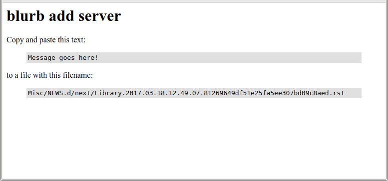

blurb
=====

These docs are out of date
--------------------------

Just a quick notice: these docs are currently out of date.
Much of what they say is accurate, but far from all, and
it's probably hard to tell which is which.  In other words,
I wouldn't pay much attention to the technical details in
this document right now, if I were you.

Overview
--------

**blurb** is a tool designed to rid CPython core development
of the scourge of ``Misc/NEWS`` conflicts.

The core concept: split ``Misc/NEWS`` into hundreds of
separate text files that, when concatenated back together
in sorted order, reconstitute the original ``Misc/NEWS`` file.
After that, ``Misc/NEWS`` should be deleted from the CPython
repo, and thereafter rendered on demand (e.g. when building
a release).  When checking in a change to CPython, the checkin
process will write out a new file that sorts into the correct place,
using a filename unlikely to have a merge conflict.

**blurb** is a single command with a number of subcommands.
It will only run inside a valid CPython (git) repo,
and automatically uses the correct file paths.
There's no install process, simply add ``blurb`` to a directory
on your path.

blurb is a prototype
--------------------

Please keep in mind, **blurb** is currently a prototype.
Don't run it in a CPython checkout where you're doing real work.

Files used by blurb
-------------------

**blurb** uses a new directory tree called ``Misc/NEWS.d``.
Everything it does is in there, except for possibly
modifying ``Misc/NEWS``.

Under ``Misc/NEWS.d`` are directories for each CPython
version for which **blurb** has news entries.  There are two
special files that may be in each version directory:

* ``release.date.rst`` contains the release date for the version.

* ``no.changes.rst`` contains a custom message for that version,
  if that version doesn't have any changes.

The other files in the version directory must match the shell wildcard::

    <section>.*.rst

That is, they must start with the name of the section the news entry
should go into (like "Library" or "IDLE"), and they must end with ``.rst``.
When merging the NEWS file back together, these files are read in reverse
sorted order.

blurb subcommands
-----------------

Like many modern utilities, **blurb** has only one executable
(called ``blurb``), but provides a diverse set of functionality
through subcommands.  The subcommand is the first argument specified
on the command-line.

If no subcommand is specified, **blurb** assumes you meant *blurb add*.

blurb help
~~~~~~~~~~

**blurb** is self-documenting through the *blurb help* subcommand.
Run without any further arguments, it prints a list of all subcommands,
with a one-line summary of the functionality of each.  Run with a
third argument, it prints help on that subcommand (e.g. ``blurb help tidy``).

blurb split
~~~~~~~~~~~

*blurb split* is the first step.  It reads in ``Misc/NEWS``
and splits it into hundreds of individual text files.
The text files are stored in a directory tree named as
follows::

    Misc/NEWS.d/<version>/<section>.<number>.rst

``<version>`` is the version number of Python where the
change was committed.  Pre-release versions are denoted
with an abbreviation: ``a`` for alphas, ``b`` for betas,
and ``rc`` for release candidates.

``<section>`` is the appropriate section of ``Misc/NEWS``
for this news item.  Examples:
``Core and builtins``, ``Libraries``, ``Tests``.

``<number>`` is a simple number.  Later entries have higher
numbers.
(Note: ``<number>`` *must* start with 0.  **blurb** relies
on this to ensure the blurbs are sorted correctly.)

*blurb split* also writes out the ``release.date.rst`` and
``no.changes.txt`` files as needed.

blurb add
~~~~~~~~~

*blurb add* adds a new Misc/NEWS entry for you.

The template for the *blurb add* message looks like this::

    Issue #:

The template also contains a list of the valid
``Misc/NEWS`` "sections" the entry could be added to.
All the entries are commented out, and the user is
encouraged to uncomment exactly one of them.

When *blurb add* gets a valid entry, it writes it to a file
with the following filename::

    Misc/NEWS.d/next/<section>.<timestamp>.<md5hash>.txt

``<section>`` is the section provided in the checkin message.

``<timestamp>`` is the current UTC time, formatted as
``YYYY.MM.DD.hh.mm.ss``.

``<md5hash>`` is the MD5 hash of the contents of the checkin
message, formatted as a *hexdigest*.

This filename ensures several things:

* All entries in ``Misc/NEWS`` will be sorted by time.

* It is unthinkably unlikely that there'll be a conflict
  between the filenames generated for two developers checking in,
  even if they check in at the exact same second.

Finally, *blurb add* stages the file in git for you.

blurb merge
~~~~~~~~~~~

*blurb merge* recombines all the files in the
``Misc/NEWS.d`` tree back into a single ``NEWS`` file.

*mergenews* accepts only a single command-line argument:
the file to write to.  By default it overwrites ``Misc/NEWS``.

Splitting and recombining the existing ``Misc/NEWS`` file
doesn't recreate the previous ``Misc/NEWS`` exactly.  This
is because ``Misc/NEWS`` never used a consistent ordering
for the "sections" inside each release, whereas *blurb merge*
has a hard-coded preferred ordering for the sections.

blurb release
~~~~~~~~~~~~~

*blurb release* is used by the release manager as part of
the CPython release process.  It takes exactly one argument,
the name of the version being released.

Here's what it does under the hood:

* Creates the ``Misc/NEWS.d/<version>`` directory as needed.
* Updates the ``release.date.rst`` file with the current version.
* Moves all recently-added NEWS entries from
  the ``next`` directory to the correct version-name directory.
* If there are no NEWS entries at all, creates a ``no.changes.txt``

One hidden feature: if the version specified is ".", *blurb release*
uses the name of the directory CPython is checked out to.
(When making a release I generally name the directory after the
version I'm releasing, and using this shortcut saves me some typing.)

blurb tidy
~~~~~~~~~~

In an attempt to soothe some folks who worry about an explosion
of checked-in files, I added one more option: *blurb tidy*.
This takes a command-line option of a version directory.
It combines all the NEWS entries in that directory into just
a few files, one per NEWS section.  This reduces the number
of files in a version directory from possibly hundreds to
a maximum of about a dozen.

The "next" directory
--------------------

You may have noticed that *blurb add* adds news entries to
a directory called ``next``, and *blurb release* moves those
news entries to the correctly-named version directory.  Why
is that?

First, it makes naming the next version a late-binding decision.
If we are currently working on 3.6.5rc1, but there's a zero-day
exploit and we need to release an emergency 3.6.5 final, we don't
have to fix up a bunch of metadata.

Second, it means that if you cherry-pick a commit forward or
backwards, you automatically pick up the NEWS entry too.  You
don't need to touch anything up--the system will already do
the right thing.  If NEWS entries were already written to the
final version directory, you'd have to move those around as
part of the cherry-picking process.

The "add_server"
----------------

Nick Coghlan points out that it'd be nice if contributors didn't
have to install and use a new tool.  We can do that!  Submitted
for your consideration is the **blurb** "add_server", a simple!
prototype! dynamic web page that assists in constructing **blurb**
NEWS entries.

The basic idea: the contributor fills out a form, presses "Submit",
and is given text to copy-and-paste into a file and what to name
the file.

Here's a sample of the input form:

And here's what the result might look like:

To try it yourself, simply install Flask then run ``python3 server.py`` from
the ``add_server`` directory.

Notes / Concerns / Possible Future Enhancements
-----------------------------------------------

* I suspect **blurb** doesn't run well under Windows.
  Who knows... it hasn't been tested.

* Currently **blurb** requires new news entries to start
  with either ``Issue #<number>:`` or ``bpo-<number>:``.
  We should probably standardize on one, and **blurb** should
  convert all existing entries to use that standardized form.

Copyright
---------

**blurb** is Copyright 2015-2017 by Larry Hastings.
Licensed to the PSF under a contributor agreement.
